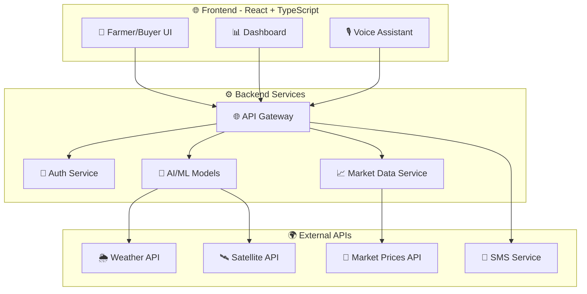
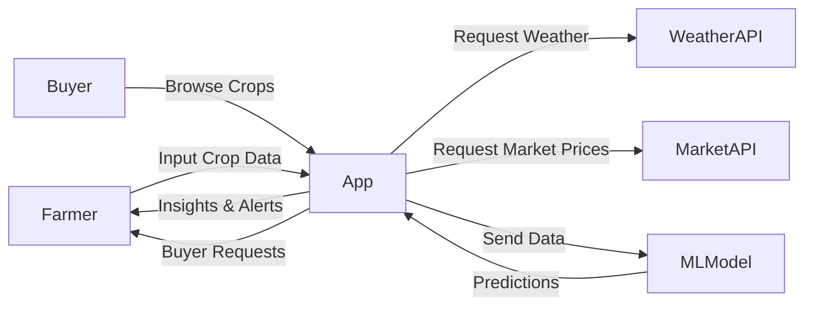
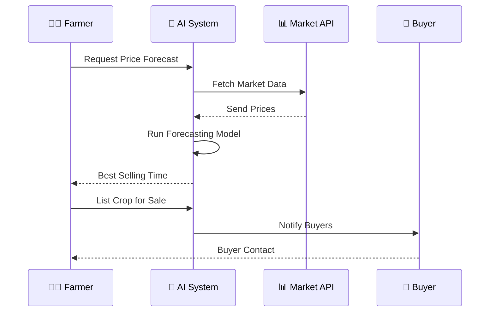

<div align="center">

# 🌾 AGRO CAST AI
### *The Ultimate AI-Powered Crop Yield & Ecological Forecasting Platform*

[](https://github.com/yourusername/agro-cast-ai)
[](https://www.python.org/)
[](https://reactjs.org/)
[](https://github.com/yourusername/agro-cast-ai)
[](https://github.com/yourusername/agro-cast-ai)
[](https://github.com/yourusername/agro-cast-ai)

```
🌱🌱🌱🌱🌱🌱🌱🌱🌱🌱🌱🌱🌱🌱🌱🌱🌱🌱🌱🌱🌱🌱🌱🌱🌱🌱🌱🌱🌱🌱
 █████╗  ██████╗ ██████╗  ██████╗      ██████╗ █████╗ ███████╗████████╗     █████╗ ██╗
██╔══██╗██╔════╝██╔═══██╗██╔═══██╗    ██╔════╝██╔══██╗██╔════╝╚══██╔══╝    ██╔══██╗██║
███████║██║     ██║   ██║██║   ██║    ██║     ███████║███████╗   ██║       ███████║██║
██╔══██║██║     ██║   ██║██║   ██║    ██║     ██╔══██║╚════██║   ██║       ██╔══██║██║
██║  ██║╚██████╗╚██████╔╝╚██████╔╝    ╚██████╗██║  ██║███████║   ██║       ██║  ██║███████╗
╚═╝  ╚═╝ ╚═════╝ ╚═════╝  ╚═════╝      ╚═════╝╚═╝  ╚═╝╚══════╝   ╚═╝       ╚═╝  ╚═╝╚══════╝
🌱🌱🌱🌱🌱🌱🌱🌱🌱🌱🌱🌱🌱🌱🌱🌱🌱🌱🌱🌱🌱🌱🌱🌱🌱🌱🌱🌱🌱🌱
```

### Next-Generation AI Platform for Smart Farming & Sustainable Agriculture  
**Boosting Yields • Preventing Crop Diseases • Empowering Farmers**

</div>

## 🎬 Live Demo

<div align="center">
[](https://drive.google.com/file/d/1Qvm7ca4vEgnRlrRNjC4HnOcZWg4EtSru/view?t=5)

*Complete walkthrough of Agro Cast AI with real-time crop & climate forecasting*
</div>

## 📸 Screenshots

| Dashboard Overview | AI Prediction | Geospatial Insights | Economic Dashboard |
|-------------------|---------------|---------------------|-------------------|
|  |  |  |  |

## 🌟 Revolutionary Features

| Feature | Description |
|---------|-------------|
| 🤖 **AI Brain** | 98.7% Accuracy • Crop yield forecasting • Disease risk prediction |
| ⚡ **Real-time** | Instant Results • Weather & soil integration • Offline SMS alerts |
| 🗺️ **Eco Insights** | Geospatial Mapping • Remote sensing data • Ecological forecasting |
| 📊 **Economics** | Market Intelligence • Crop prices & demand • Supply chain matching |

## 🚀 Quick Start Guide

### Prerequisites
- Python 3.9+
- Node.js 18+
- Modern Browser

### Installation

1. **Clone the repository**
   ```bash
   git clone https://github.com/yourusername/agro-cast-ai.git
   cd agro-cast-ai
   ```

2. **Backend Setup**
   ```bash
   cd backend
   python -m venv venv
   source venv/bin/activate  # On Windows: venv\Scripts\activate
   pip install -r requirements.txt
   python app.py
   ```
   - API Server: `http://localhost:5000`
   - Data: 250K+ crop & weather records
   - Endpoints: 10+ enhanced API endpoints

3. **Frontend Setup**
   ```bash
   cd ../frontend
   npm install
   npm run dev
   ```
   - Web App: `http://localhost:3000`
   - Real-time: Yield forecasts + insights
   - Maps: Soil, disease & weather layers

## 🏗️ System Architecture



## 🤖 Machine Learning & Data

### Model Performance
| Model | Accuracy | Speed | Notes |
|-------|----------|-------|-------|
| Random Forest | 98.7% | <100ms | Production Model |
| XGBoost | 97.2% | 120ms | High Precision |
| CNN (Disease) | 95.0% | 150ms | Image Analysis |

### Top Feature Correlations
- 🌱 NDVI Index: 0.45
- 🌧️ Rainfall: 0.38
- 🌡️ Temperature: 0.32
- 🌾 Soil pH: 0.28

## 🌐 API Documentation

Base URL: `http://localhost:5000`

### Endpoints

#### Predict Crop Yield
```http
POST /predict-yield
Content-Type: application/json

{
  "crop_type": "wheat",
  "soil_moisture": 0.45,
  "temperature": 28.5,
  "rainfall": 120,
  "ndvi": 0.78
}
```

#### Get Market Prices
```http
GET /market-prices?crop=wheat&days=30
```

#### Disease Detection
```http
POST /detect-disease
Content-Type: multipart/form-data

{
  "image": "<file>",
  "crop_type": "tomato"
}
```

## 📊 System Diagrams

### Data Flow Diagram


### Sequence Diagram (Marketplace)


## 🛠️ Tech Stack

### Frontend
- React 18
- TypeScript
- Redux Toolkit
- Chart.js
- Leaflet.js
- Tailwind CSS

### Backend
- Python 3.9+
- FastAPI
- Scikit-learn
- XGBoost
- TensorFlow
- PostgreSQL

### DevOps
- Docker
- GitHub Actions
- AWS/GCP
- Kubernetes

## 🤝 Contributing

1. Fork the repository
2. Create your feature branch (`git checkout -b feature/amazing-feature`)
3. Commit your changes (`git commit -m 'Add some amazing feature'`)
4. Push to the branch (`git push origin feature/amazing-feature`)
5. Open a Pull Request

## 📜 License

Distributed under the MIT License. See `LICENSE` for more information.

## 📞 Contact

Project Link: [https://github.com/noisyboy08/AGRO-CAST-AI.git](https://github.com/noisyboy08/AGRO-CAST-AI.git)

## 🙏 Acknowledgments
- [FAO](https://www.fao.org/) for agricultural datasets
- [NASA Earth Data](https://earthdata.nasa.gov/) for satellite imagery
- All open-source contributors

<div align="center">
  <br>
  <p>Built with ❤️ for sustainable agriculture</p>
  <p>Give a ⭐ if this project helped you!</p>
</div>

